# Portfolio Management app

## Table of Contents
- [Description](#description)
- [App Screenshots](#app-screenshot)
- [Requirements](#requirements)
- [Variables Settings](#variables-settings)
- [Installation](#installation)
  - [Marketplace](#marketplace)
  - [Create Catalog](#create-catalog)
  - [Assign Default Catalog](#assign-default-catalog)
  - [Genie Space Permission](#genie-space-permission)
  - [Activate Multiple Previews](#activate-multiple-previews)
  - [Dashboard Embedding](#dashboard-embedding)
  - [Knowledge Assistant Creation](#knowledge-assistant-creation)
  - [Multi-Agent Supervisor](#multi-agent-supervisor)
  - [Apps Permissions to Agent Bricks](#apps-permissions-to-agent-bricks)
  - [Copy Lakebase Variables](#copy-the-lakebase-variables-from-the-app)
  - [Connect to Lakebase](#connect-to-lakebase)
  - [Sync Lakebase Table](#to-sync-the-lakebase-table)
- [Local Testing/Development](#local-testingdevelopment)
- [Deploy APP Only](#deploy-app-only)
- [MISC](#misc)

## Description

The demo is an application that provides various tools for a Portfolio
manager

It deploys the following components:

- Serverless workspace and metastore
- Unity Catalog
- Lakeflow job (creates tables, volume, functions)
- Lakeflow pipeline (Streaming table and Materialized view)
- Marketplace integration
- AI/BI (Dashboard and Genie)
- Agent Bricks Knowledge Assistant
- Agent Bricks Multi-Agent Supervisor
- Databricks Apps
- Lakebase

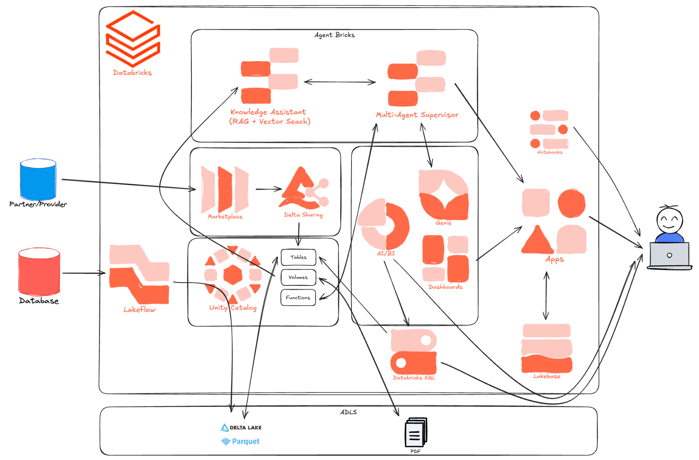

## App screenshot:

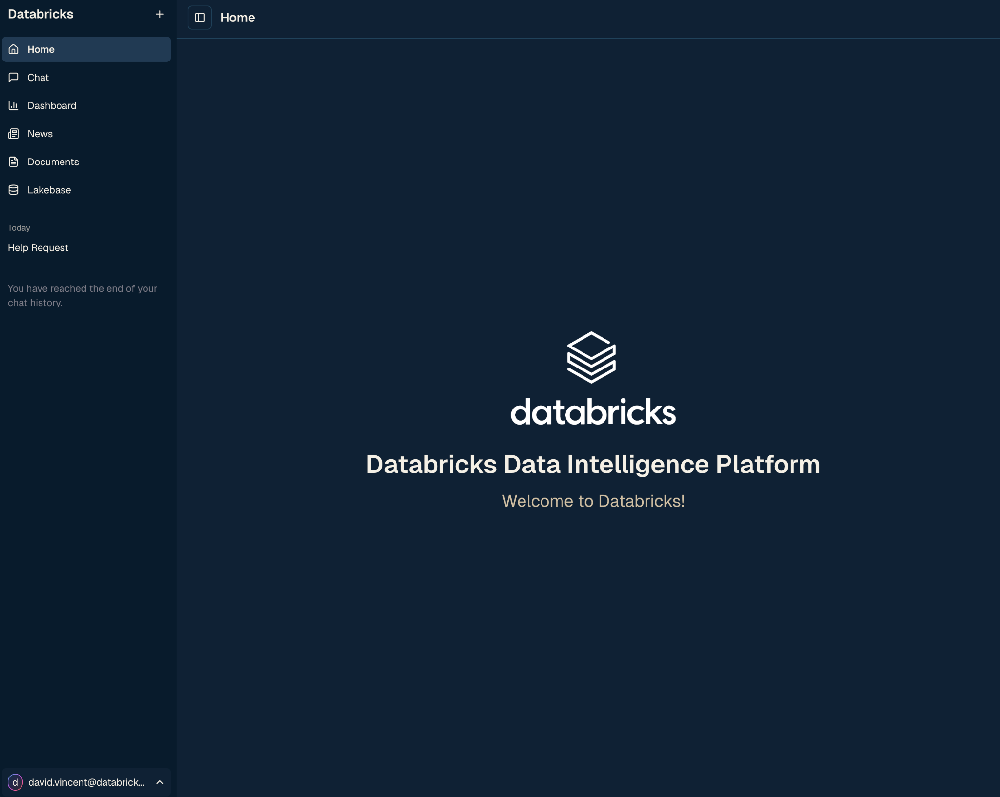

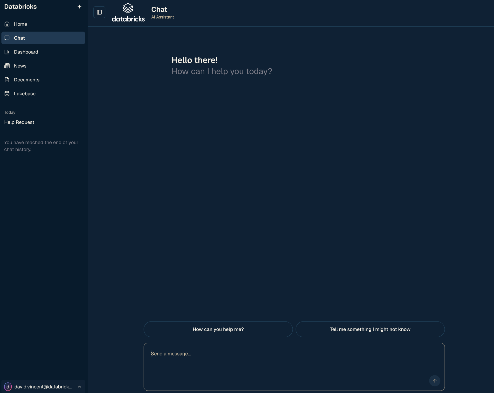

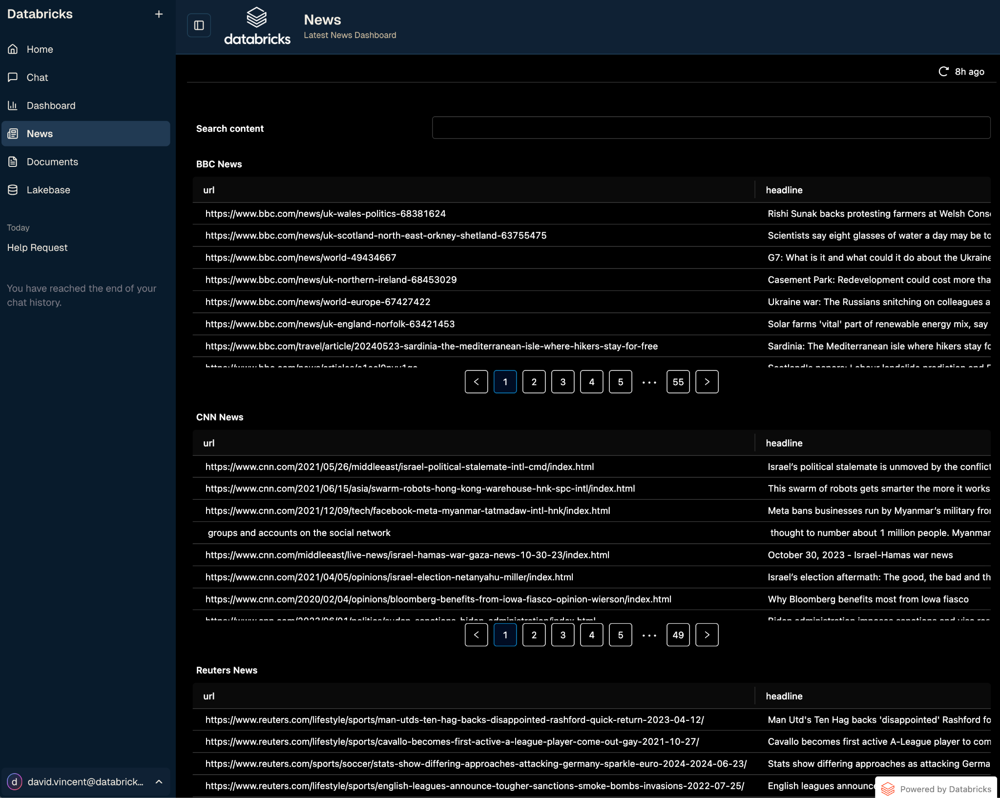

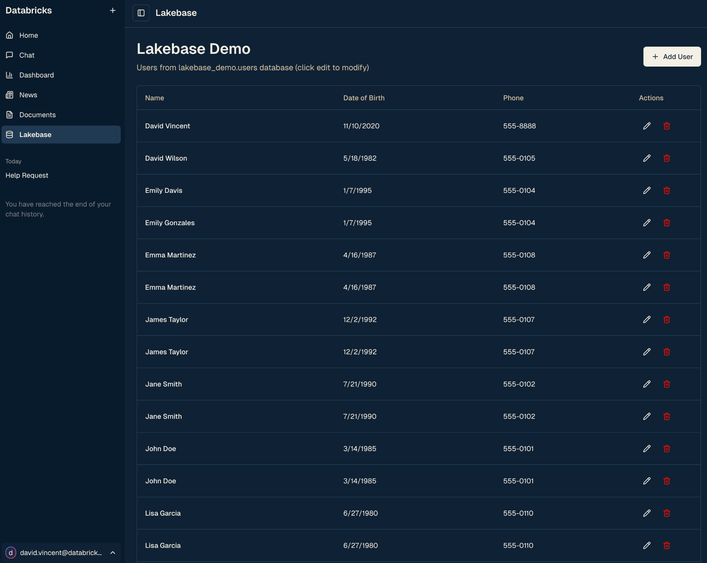

## Requirements

- Terraform, Databricks CLI, JQ
- Databricks account admin

## Variables settings

1.  For the workspace creation, update the variables in the terraform.tfvars.example file\
    ( terraform/account/terraform.tfvars.example )
    Copy terraform.tfvars.example to terraform.tfvars and change the variables where you see update "[UPDATE]"

2.  For the application, update the variables in the databricks.yml file\
    (dabs/databricks.yml)\
    You only need to update the default value for the profile, email, catalog, schema.\
    Leave the other values as is.

## Installation

Some components do not have APIs yet. Some manual steps, described
below, are required.

1.  In a terminal, go to the root folder of the demo and run\
    `./deploy.sh`

    When asked, run the manual configuration steps

2.  Marketplace\
    !-!-!-!-!-!-!-!-!-!-!-!-!-!-!-!-!-!-!-!-!-!-!-!-!-!-!-!-!-!-!-!-!-!-!-!-!-!-!-!-!-!-!-!-!-!-!-!-\
    ACTION REQUIRED: manually create the marketplace tables called \'news\' from the UI\
    !-!-!-!-!-!-!-!-!-!-!-!-!-!-!-!-!-!-!-!-!-!-!-!-!-!-!-!-!-!-!-!-!-!-!-!-!-!-!-!-!-!-!-!-!-!-!-!-

    - In the Databricks UI, click on Marketplace
    - In the search box, type 'BBC/Google/CNN/Reuters News listing'
    - Click 'Get instant access'

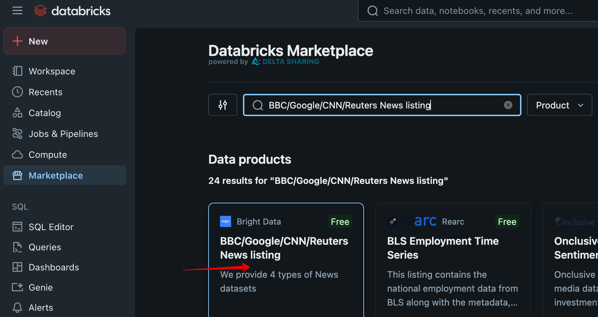

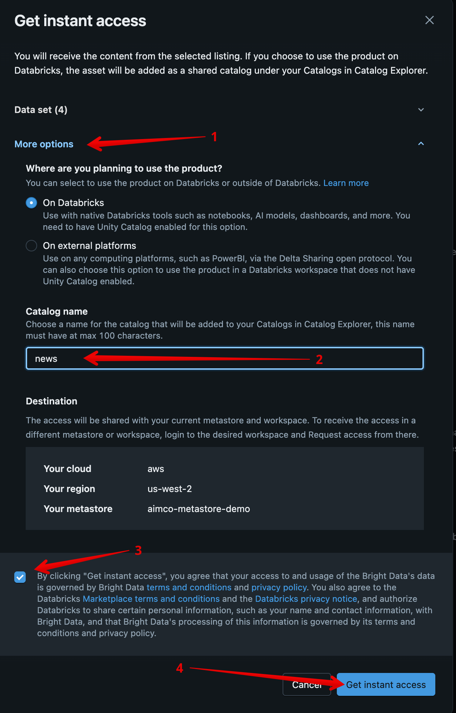

3.  Create Catalog\
    !-!-!-!-!-!-!-!-!-!-!-!-!-!-!-!-!-!-!-!-!-!-!-!-!-!-!-!-!-!-!-!-!-!-!-!-!-!-!-!-!-!-!-!-!-!-!-!-\
    ACTION REQUIRED: manually create the catalog with the same name as the\
    one have set in the databricks.yml file. (Currently a bug)\
    !-!-!-!-!-!-!-!-!-!-!-!-!-!-!-!-!-!-!-!-!-!-!-!-!-!-!-!-!-!-!-!-!-!-!-!-!-!-!-!-!-!-!-!-!-!-!-!-

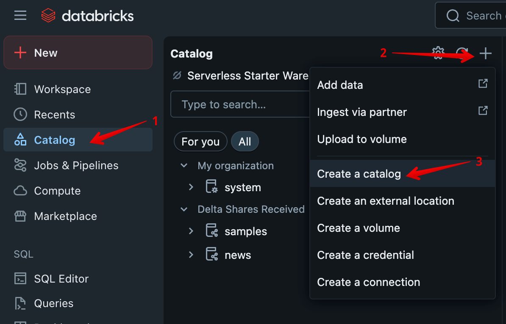

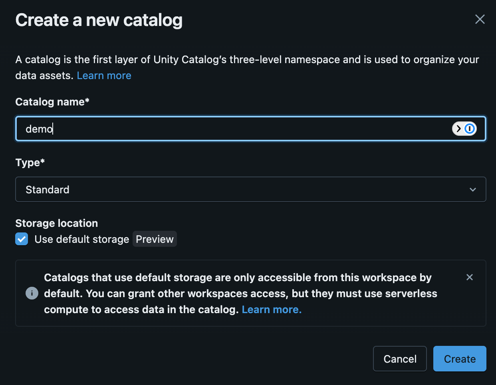

4.  Assign Default Catalog\
    !-!-!-!-!-!-!-!-!-!-!-!-!-!-!-!-!-!-!-!-!-!-!-!-!-!-!-!-!-!-!-!-!-!-!-!-!-!-!-!-!-!-!-!-!-!-!-!-\
    ACTION REQUIRED: in the UI, set the workspace default catalog to the catalog you have just created\
    !-!-!-!-!-!-!-!-!-!-!-!-!-!-!-!-!-!-!-!-!-!-!-!-!-!-!-!-!-!-!-!-!-!-!-!-!-!-!-!-!-!-!-!-!-!-!-!-

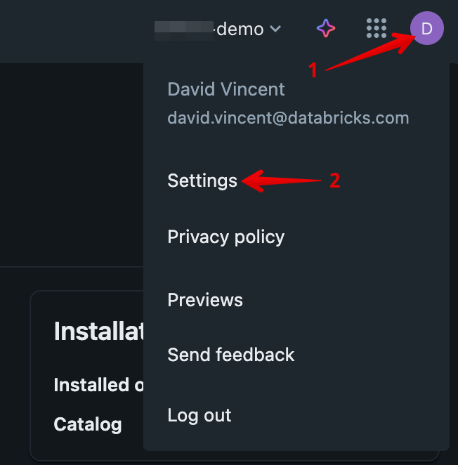
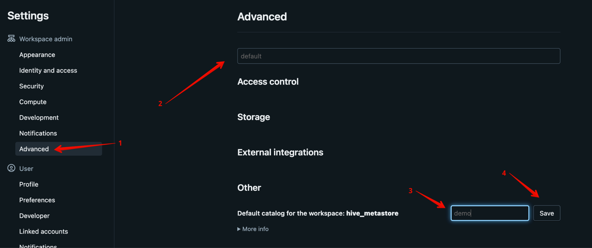

5.  Genie Space permission\
    !-!-!-!-!-!-!-!-!-!-!-!-!-!-!-!-!-!-!-!-!-!-!-!-!-!-!-!-!-!-!-!-!-!-!-!-!-!-!-!-!-!-!-!-!-!-!-!-\
    ACTION REQUIRED: Manually grant access to the Genie space to all users\
    !-!-!-!-!-!-!-!-!-!-!-!-!-!-!-!-!-!-!-!-!-!-!-!-!-!-!-!-!-!-!-!-!-!-!-!-!-!-!-!-!-!-!-!-!-!-!-!-\
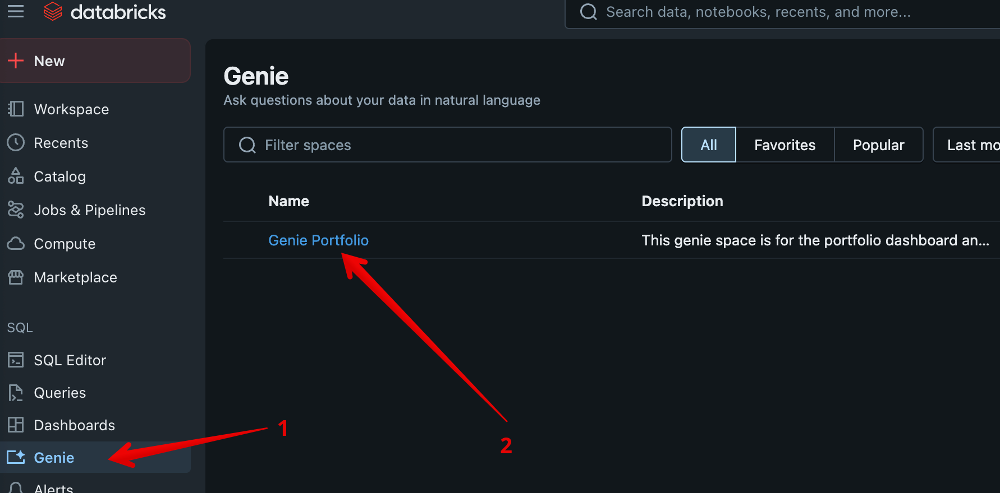
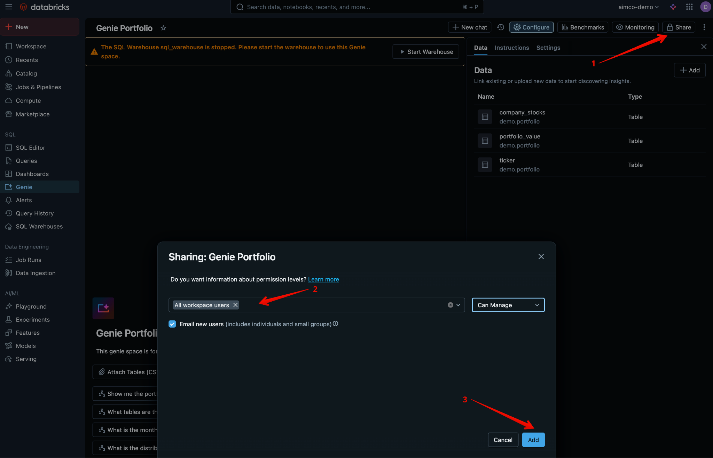

6.  Activate multiple previews\

    !-!-!-!-!-!-!-!-!-!-!-!-!-!-!-!-!-!-!-!-!-!-!-!-!-!-!-!-!-!-!-!-!-!-!-!-!-!-!-!-!-!-!-!-!-!-!-!-\
    ACTION REQUIRED: Activate the preview feature \'Mosaic AI Agent BricksPreview\' in the UI\
    !-!-!-!-!-!-!-!-!-!-!-!-!-!-!-!-!-!-!-!-!-!-!-!-!-!-!-!-!-!-!-!-!-!-!-!-!-!-!-!-!-!-!-!-!-!-!-!-

    !-!-!-!-!-!-!-!-!-!-!-!-!-!-!-!-!-!-!-!-!-!-!-!-!-!-!-!-!-!-!-!-!-!-!-!-!-!-!-!-!-!-!-!-!-!-!-!-\
    ACTION REQUIRED: Activate the preview feature \'External Tool Calling for Agents\' in the UI \
    !-!-!-!-!-!-!-!-!-!-!-!-!-!-!-!-!-!-!-!-!-!-!-!-!-!-!-!-!-!-!-!-!-!-!-!-!-!-!-!-!-!-!-!-!-!-!-!-

    !-!-!-!-!-!-!-!-!-!-!-!-!-!-!-!-!-!-!-!-!-!-!-!-!-!-!-!-!-!-!-!-!-!-!-!-!-!-!-!-!-!-!-!-!-!-!-!-\
    ACTION REQUIRED: Activate both preview features \'On-Behalf-Of-User Authorization\' in the UI \
    !-!-!-!-!-!-!-!-!-!-!-!-!-!-!-!-!-!-!-!-!-!-!-!-!-!-!-!-!-!-!-!-!-!-!-!-!-!-!-!-!-!-!-!-!-!-!-!\-
    
    !-!-!-!-!-!-!-!-!-!-!-!-!-!-!-!-!-!-!-!-!-!-!-!-!-!-!-!-!-!-!-!-!-!-!-!-!-!-!-!-!-!-!-!-!-!-!-!-\
    ACTION REQUIRED: Activate the preview features \'Managed MCP Servers\' in the UI \
    !-!-!-!-!-!-!-!-!-!-!-!-!-!-!-!-!-!-!-!-!-!-!-!-!-!-!-!-!-!-!-!-!-!-!-!-!-!-!-!-!-!-!-!-!-!-!-!-

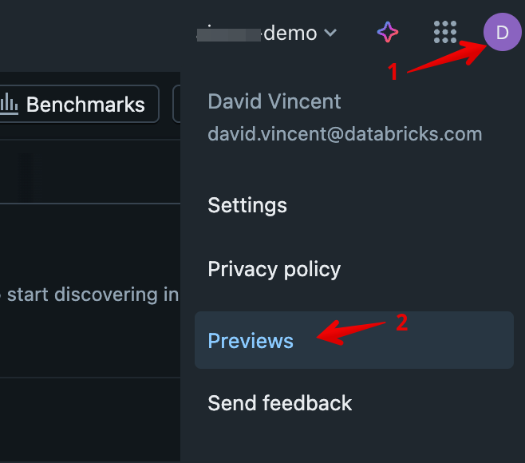

7.  Dashboard embedding\
    !-!-!-!-!-!-!-!-!-!-!-!-!-!-!-!-!-!-!-!-!-!-!-!-!-!-!-!-!-!-!-!-!-!-!-!-!-!-!-!-!-!-!-!-!-!-!-!-\
    ACTION REQUIRED: Grant access to allow dashboard embedding\
    (Settings/security/embed dashboard) \
    !-!-!-!-!-!-!-!-!-!-!-!-!-!-!-!-!-!-!-!-!-!-!-!-!-!-!-!-!-!-!-!-!-!-!-!-!-!-!-!-!-!-!-!-!-!-!-!-

8.  Knowledge Assistant creation\
    (you might need to refresh the browser to see the Agents menu)

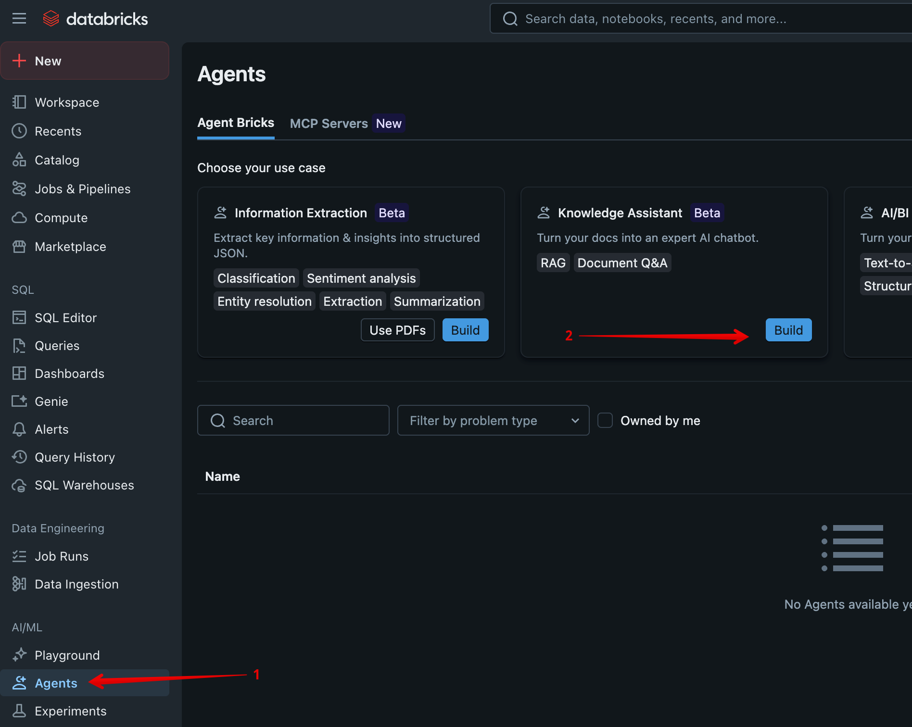

Enter the following under Basic Info\
**Name**: knowledge-assistant-rag\
**Description**: RAG Chatbot for financial documentation, including 10K, 10Q and earning calls

Enter the following under Configure Knowledge Sources\
**Source**: demo/portfolio/artifacts/pdf\
**Describe the content**: Financial PDF documents, including 10K, 10Q and earning calls

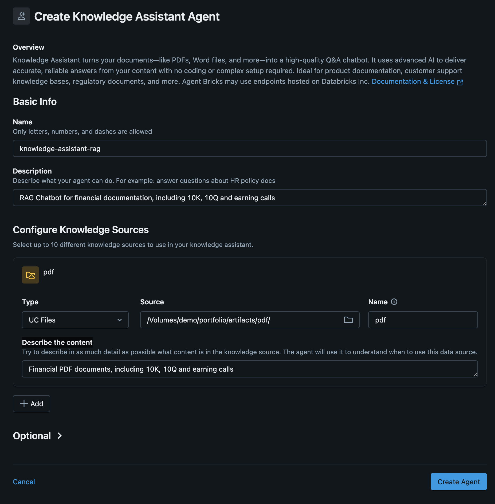

Once created, keep in mind it might take a couple of minutes to parse all documents...

9.  Multi-Agent Supervisor

    !-!-!-!-!-!-!-!-!-!-!-!-!-!-!-!-!-!-!-!-!-!-!-!-!-!-!-!-!-!-!-!-!-!-!-!-!-!-!-!-!-!-!-!-!-!-!-!-\
    ACTION REQUIRED: Create the Multi-agent Supervisor\
    !-!-!-!-!-!-!-!-!-!-!-!-!-!-!-!-!-!-!-!-!-!-!-!-!-!-!-!-!-!-!-!-!-!-!-!-!-!-!-!-!-!-!-!-!-!-!-!-

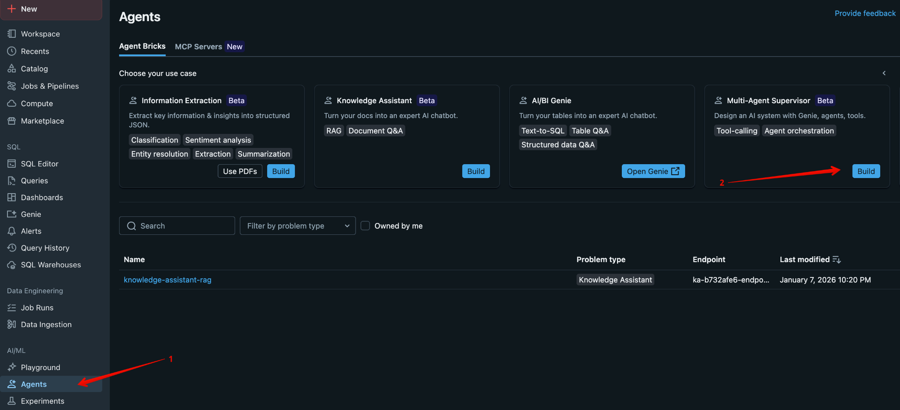

**Name**: multi-agent-supervisor\
**Description**: This Multi-Agent Supervisor answers questions on financial data. It includes Genie for structure data, RAG endpoint for PDF documents and functions to get news sentiment on various companies.

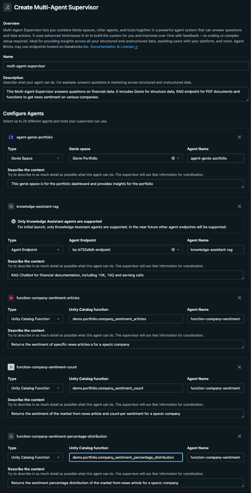

Copy the Endpoint and paste it in the CLI
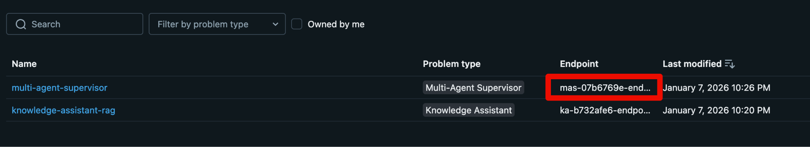

10. Apps permissions to Agent Bricks\
    !-!-!-!-!-!-!-!-!-!-!-!-!-!-!-!-!-!-!-!-!-!-!-!-!-!-!-!-!-!-!-!-!-!-!-!-!-!-!-!-!-!-!-!-!-!-!-!-\
    ACTION REQUIRED: Manually assign the app Service Principal the right to use\
    the Multi-agent Supervisor and the Knowledge Assistant Agent endpoints\
    !-!-!-!-!-!-!-!-!-!-!-!-!-!-!-!-!-!-!-!-!-!-!-!-!-!-!-!-!-!-!-!-!-!-!-!-!-!-!-!-!-!-!-!-!-!-!-!-

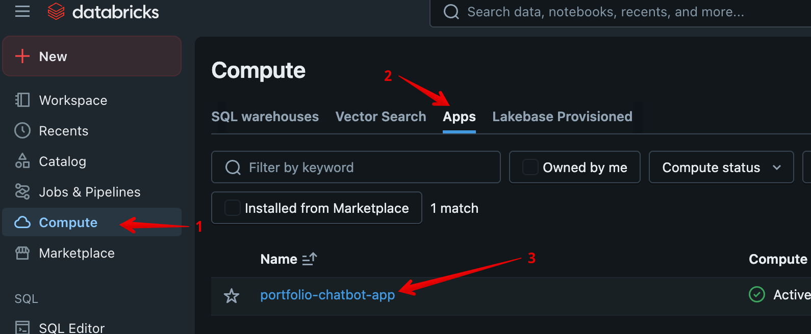

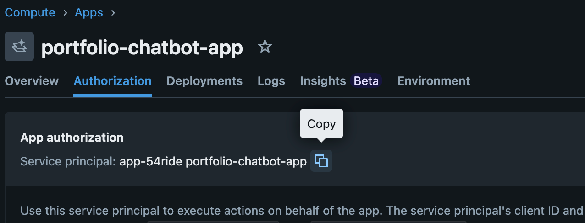

In BOTH agents, assign the Service Principle permission to query the endpoint\

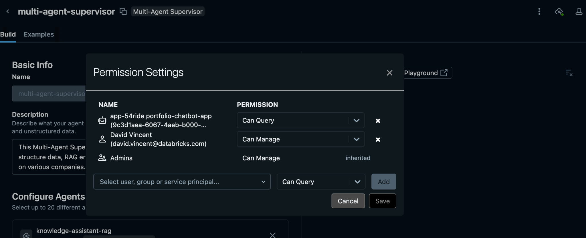

11. Copy the lakebase variables from the APP\
    !-!-!-!-!-!-!-!-!-!-!-!-!-!-!-!-!-!-!-!-!-!-!-!-!-!-!-!-!-!-!-!-!-!-!-!-!-!-!-!-!-!-!-!-!-!-!-!-\
    ACTION REQUIRED: Copy the lakebase variables in the file dabs/lakebase/lakebase_variable.sh\
    !-!-!-!-!-!-!-!-!-!-!-!-!-!-!-!-!-!-!-!-!-!-!-!-!-!-!-!-!-!-!-!-!-!-!-!-!-!-!-!-!-!-!-!-!-!-!-!-
    
    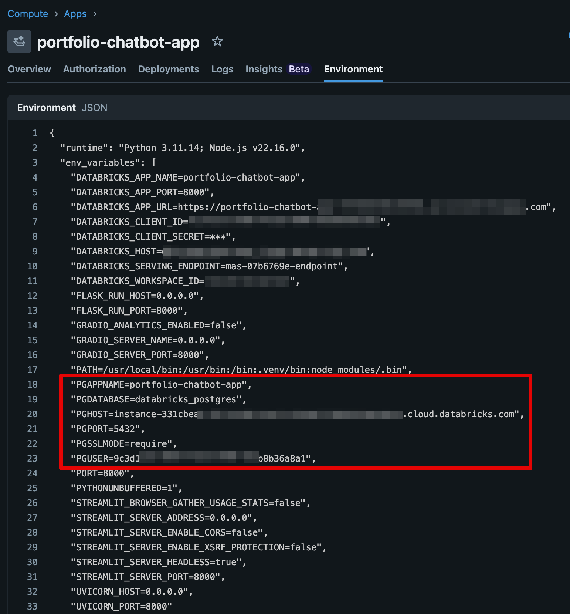

12. Connect to Lakebase

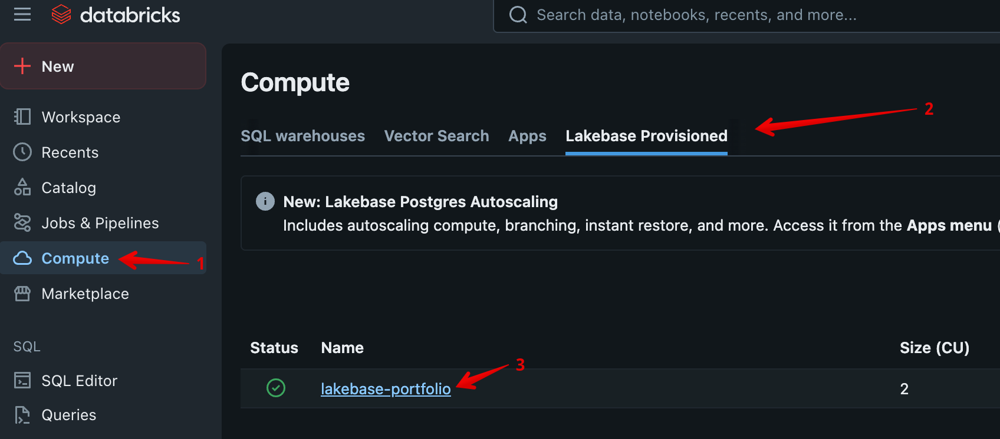

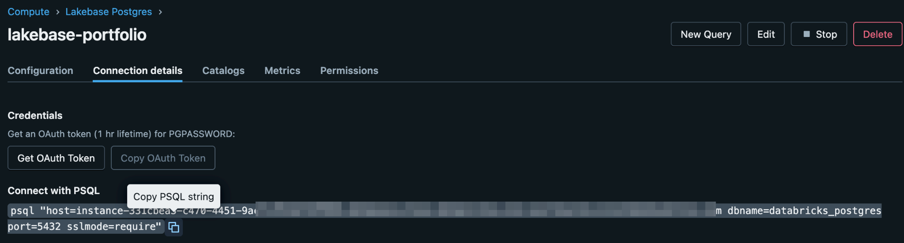

    Paste in the CLI\
    Get OAuth Token + Copy OAuth token + Paste in the CLI\

13. To sync the lakebase table

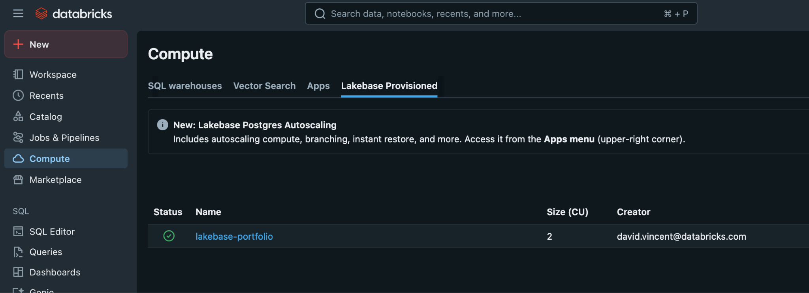

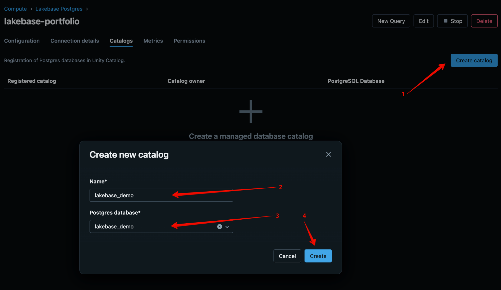

## Local testing/development

1.  `cd dabs`
2.  `./dev_locally.sh`

## Deploy APP only 

To deploy a new version of the app only, without deploying everything else:

1.  `cd dabs/apps`
2.  `source ../login_new_workspace.sh`
3.  `databricks bundle deploy \--target dev`
4.  `databricks bundle run databricks_portfolio_apps`

## MISC

Question that leverages various agents in the same question, proving multi-agentic system:

I want to know which stock I have the most and for that stock, give me the top 3 risks highlighted in the financial docs and what is the market sentiment from the news
